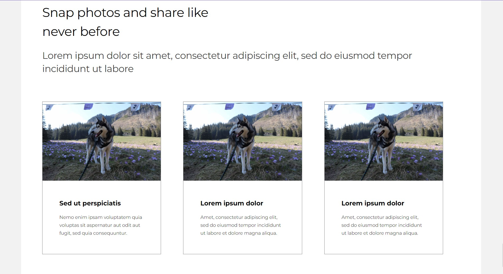
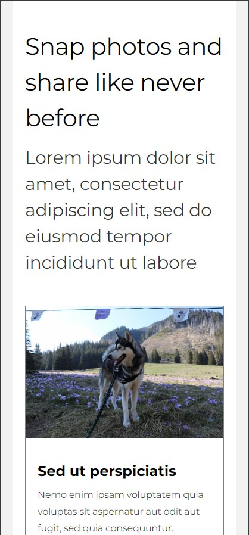

# Non-agency recruitment task - HTML and CSS Implementation

A web page built with semantic HTML and optimized CSS following the BEM convention, recreated from a Figma design mockup. This project focuses on minimizing boilerplate, sharing styles across sections for efficiency, and maintaining semantic structure for SEO enhancement. Special attention has been given to ensuring all images, including placeholders, have descriptive alternative texts.

## Screenshots

## Table of Contents

- [Features](#features)
- [Installation](#installation)
- [Usage](#usage)
- 
## Features

- Semantic HTML structure improving SEO.
- CSS styles shared across sections to minimize code redundancy.
- Every image, including placeholders, comes with alternative descriptions for better accessibility.
- Individual styling for images to ensure they fit well into the design, regardless of their original size.
- Mobile responsive design with defined breakpoints.
- Interactive elements such as hover effects on buttons.

## Installation

1. To get started, clone the repository and open it in Visual Studio Code.
2. In VSC go to the Extensions view by clicking on the square icon on the left sidebar.
3. Search for "Live Server" in the Extensions marketplace.
4. Click on the Install button to install the Live Server extension.

## Usage

To start the live server: 
With the index.html file open in the editor right-click on the document and select "Open with Live Server", or click on the "Go Live" button in the status bar at the bottom of VSC.

Open http://127.0.0.1:5500/index.html to view the website in your browser. (5500 is the default port)
